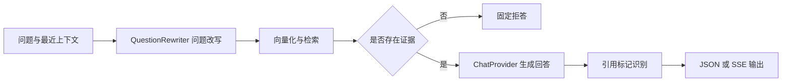

# 阶段 2D：流式多轮问答体验设计

## 1. 文档信息

- 状态：待书面审阅
- 日期：2026-07-14
- 依赖：阶段 2C 文档管理完成并合并
- 对应分支：`codex/stage-2d-question-experience`
- 目标读者：后端、前端与测试开发者

## 2. 背景

当前系统已经具备知识库检索问答能力，但问答接口会等待完整答案生成后一次性返回 JSON。用户在等待期间看不到处理阶段，无法停止生成，也不能在刷新页面后继续当前浏览器标签页中的对话。

阶段 2D 在不引入服务端会话表的前提下，补齐适合演示和日常使用的问答体验：

1. 答案以 SSE 流式返回。
2. 展示改写后的独立问题、检索片段数和各阶段耗时。
3. 支持真正的上下文多轮追问。
4. 引用随答案中的引用标记逐步出现，并在结束时统一校准。
5. 支持停止、失败保留、重试、新建会话和清空历史。
6. 浏览器标签页刷新后可恢复历史，关闭标签页后自动失效。
7. 答案支持经过严格清洗的 Markdown 展示。

本阶段继续遵循“固定流程解决确定性步骤”的原则。问题改写、检索和回答是明确的流水线，不引入 Agent 自主规划。

## 3. 目标与非目标

### 3.1 目标

- 保持现有 JSON 问答接口兼容，不影响已有调用方。
- 新增稳定、可测试的 SSE 流式问答接口。
- 在后端将上下文追问改写为可独立检索的问题。
- 前端以知识库和当前用户为边界保存会话历史。
- 明确定义正常完成、用户停止、生成失败和无检索证据四种结果。
- 对历史长度、单条内容、Markdown 和链接进行安全约束。
- 用确定性假实现覆盖主要自动化测试，不依赖真实模型才能跑通测试套件。

### 3.2 非目标

本阶段不实现：

- 服务端会话、消息数据库表或数据库迁移。
- 多会话列表、会话标题、跨设备同步。
- 对话导出、分享或长期记忆。
- 混合检索、重排序和自动评测体系。
- WebSocket。
- Agent 工具调用或自主规划。

## 4. 总体架构

现有 RAG 服务扩展为统一流水线，旧 JSON 接口和新 SSE 接口复用相同的问题准备、检索、提示词和引用逻辑。



核心边界：

- `QuestionRewriter`：根据最近对话把追问改写为独立问题。
- `ChatProvider`：保留普通生成能力。
- `StreamingChatProvider`：增加流式生成能力。
- `RagService`：编排统一流水线，不把业务编排堆到 API 控制器中。
- SSE 编码器与引用标记追踪器：只负责传输格式和跨分片文本识别。

对 C# 开发者而言，这些边界类似接口加应用服务：控制器只接收 DTO 和返回结果，具体业务流程由应用服务统一组织，模型供应商则通过接口替换。

## 5. 后端接口设计

### 5.1 保留现有接口

继续保留：

```http
POST /api/v1/knowledge-bases/{knowledge_base_id}/questions
Content-Type: application/json
```

旧接口继续一次性返回 JSON，不要求调用方传历史。内部使用统一 RAG 流水线的空历史模式，外部响应结构保持兼容。

### 5.2 新增流式接口

```http
POST /api/v1/knowledge-bases/{knowledge_base_id}/questions/stream
Content-Type: application/json
Accept: text/event-stream
```

请求体：

```json
{
  "question": "它和上一种方案相比有什么缺点？",
  "top_k": 5,
  "history": [
    { "role": "user", "content": "请介绍向量检索方案" },
    { "role": "assistant", "content": "向量检索会先把文本转换为向量……" }
  ]
}
```

约束：

- `question` 去除首尾空白后必须非空，最长 2,000 个字符。
- `top_k` 沿用现有问答接口的范围和默认值。
- `history` 最多 12 条消息，即最多 6 轮已完成问答。
- 历史必须严格按照 `user -> assistant` 成对排列，不允许 `system` 角色。
- 单条用户历史最长 2,000 个字符，单条助手历史最长 8,000 个字符。
- 前端只发送当前会话分隔线之后、状态为 `completed` 的问答。
- 后端仍独立校验全部约束，不能信任前端。

### 5.3 SSE 响应头

流式响应至少设置：

```http
Content-Type: text/event-stream; charset=utf-8
Cache-Control: no-cache
X-Accel-Buffering: no
```

连接空闲期间定期发送 SSE 注释心跳：

```text
: ping

```

心跳不进入业务事件列表，前端可以忽略。

### 5.4 事件协议

每个事件采用标准 SSE 格式，`data` 始终是单行 UTF-8 JSON：

```text
event: status
data: {"phase":"rewriting"}

```

事件定义如下。

#### `status`

表示当前处理阶段：

```json
{ "phase": "rewriting" }
{ "phase": "retrieving" }
{ "phase": "generating" }
```

有历史时依次出现三个阶段；无历史时跳过 `rewriting` 状态，从 `retrieving` 开始。

#### `rewrite`

```json
{
  "standalone_question": "向量检索方案与关键词检索相比有什么缺点？",
  "elapsed_ms": 183
}
```

无历史时不调用改写模型，但仍发送该事件，其中 `standalone_question` 等于原问题，`elapsed_ms` 为 `0`。这样前端数据结构保持一致。

#### `retrieval`

```json
{
  "retrieved_chunk_count": 4,
  "elapsed_ms": 76
}
```

片段数是最终送入回答上下文的片段数量，不是数据库扫描数量。

#### `token`

```json
{ "delta": "向量检索的主要缺点是" }
```

`delta` 是增量文本，前端按收到顺序拼接，不假设一次事件对应完整汉字、单词或 Markdown 节点。

#### `citation`

当累计原始答案首次形成有效的 `[1]`、`[2]` 等标记后，立即发送对应引用。事件字段复用现有引用响应 DTO，例如：

```json
{
  "index": 1,
  "document_id": "文档 ID",
  "document_name": "架构说明.pdf",
  "chunk_id": "片段 ID",
  "content": "与该引用对应的片段摘要或正文"
}
```

相同引用下标只推送一次；超出检索片段范围的标记不推送。

#### `done`

正常完成时发送一次：

```json
{
  "request_id": "请求 ID",
  "citations": [],
  "retrieved_chunk_count": 4,
  "timings": {
    "rewrite_ms": 183,
    "retrieval_ms": 76,
    "generation_ms": 1240,
    "total_ms": 1512
  }
}
```

`done.citations` 是最终权威引用列表。前端用它校准此前渐进收到的引用，解决模型生成过程中标记变化或遗漏的问题。

#### `error`

流已经开始后发生错误时发送：

```json
{
  "code": "CHAT_PROVIDER_ERROR",
  "message": "回答生成失败，请稍后重试",
  "request_id": "请求 ID"
}
```

发送后关闭连接，不再发送 `done`。

### 5.5 HTTP 错误与流内错误

- 在响应流开始前发现认证失败、知识库不存在、无权限或请求格式错误，继续返回普通 `401`、`404`、`422` JSON 错误。
- 响应流开始后发生问题，使用 `error` 事件表达。
- 问题改写失败统一使用 `QUESTION_REWRITE_ERROR`。
- 回答模型失败统一使用 `CHAT_PROVIDER_ERROR`。
- 错误消息面向用户，不泄露供应商密钥、原始提示词或内部堆栈。
- `request_id` 用于日志定位，在 `done` 和 `error` 中返回。

### 5.6 认证刷新边界

流式请求复用现有访问令牌和刷新令牌协调逻辑：

- 只有服务器在发送任何 SSE 事件前返回初始 `401` 时，前端才允许刷新令牌并完整重试一次。
- 一旦已经收到事件，不允许自动重放请求，避免重复答案和重复引用。
- 知识库切换或退出登录时，中止当前流。

## 6. 问题改写与上下文规则

### 6.1 改写职责

`QuestionRewriter` 接收最近已完成历史和当前问题，输出一个可以脱离对话单独用于检索的问题。

示例：

```text
历史：用户询问“向量检索方案”，助手完成说明。
当前问题：它有什么缺点？
改写结果：向量检索方案有什么缺点？
```

### 6.2 安全要求

- 历史消息属于不可信输入，只能作为改写材料，不能覆盖系统指令。
- 改写提示词明确要求忽略历史中的命令性内容，只提取语义指代。
- 改写结果去除首尾空白后必须非空，最长 2,000 个字符。
- 改写失败不降级为悄悄使用原问题，避免检索语义错误；应返回明确的 `QUESTION_REWRITE_ERROR`。
- 无历史时完全跳过额外模型调用，直接使用当前问题。

### 6.3 提供者接口

提供者边界需要支持确定性测试替身。概念接口如下：

```python
class QuestionRewriter(Protocol):
    async def rewrite(self, history: list[ConversationMessage], question: str) -> str: ...

class ChatProvider(Protocol):
    async def generate(self, prompt: str) -> str: ...

class StreamingChatProvider(Protocol):
    async def stream(self, prompt: str) -> AsyncIterator[str]: ...
```

OpenAI 兼容实现同时支持普通生成和流式生成；测试使用固定改写结果、固定 token 序列和可控异常的假实现。

## 7. 统一 RAG 流水线

推荐在现有 `RagService` 中拆分可复用步骤，而不是复制两套问答逻辑：

1. 校验并准备当前问题与历史。
2. 需要时调用问题改写。
3. 对独立问题进行向量化和检索。
4. 构造带引用编号的证据上下文和回答提示词。
5. 根据调用方式执行普通生成或流式生成。
6. 从原始答案识别有效引用。
7. 组装旧 JSON 响应或新 SSE 事件。

### 7.1 无检索证据

没有有效片段时：

- 不调用回答模型。
- 使用系统固定拒答文本，仍通过一个或多个 `token` 事件返回。
- `retrieved_chunk_count` 为 `0`。
- 最终引用为空，并正常发送 `done`。

固定拒答避免模型在没有知识库依据时自行发挥。

### 7.2 引用标记追踪

引用识别基于累计的原始答案文本，而不是渲染后的 DOM。

追踪器必须处理标记跨 token 分片的情况，例如先收到 `[`，后收到 `1` 和 `]`。识别规则：

- 只接受形如 `[正整数]` 的标记。
- 下标必须落在本次检索片段范围内。
- 同一下标去重。
- 标记完整形成后立即产生 `citation` 事件。
- 生成结束后重新扫描完整答案，形成 `done.citations`。

### 7.3 用户停止

前端通过 `AbortController` 主动关闭请求。后端检测断开后应取消或关闭上游模型流，避免继续消耗资源。

停止属于用户动作，不记录为系统错误，也不发送伪造的 `done`。前端保留已经收到的部分答案，并标记为 `stopped`；该答案不能进入后续上下文。

## 8. 前端状态与交互设计

### 8.1 独立会话 Store

新增 `conversations` Pinia Store，不继续扩张现有工作区 Store。职责包括：

- 按当前用户和知识库读取、保存消息。
- 发起、停止和重试流式问答。
- 解析 SSE 并更新答案、引用、阶段和耗时。
- 生成发送给后端的最近上下文。
- 新建会话、清空历史和切换知识库时清理运行状态。

### 8.2 消息模型

消息类型：

- `user`：用户问题。
- `assistant`：助手回答。
- `divider`：新会话分隔线。

助手状态：

- `streaming`：正在生成。
- `completed`：正常完成，可进入后续上下文。
- `stopped`：用户停止，保留展示但不进入上下文。
- `failed`：生成失败，保留展示但不进入上下文。

助手消息同时保存：

- 累计原始 Markdown 答案。
- 渐进引用和最终引用。
- 当前阶段。
- 改写后的独立问题。
- 检索片段数。
- `rewrite_ms`、`retrieval_ms`、`generation_ms`、`total_ms`。
- 错误码和 `request_id`（如有）。

### 8.3 浏览器存储

使用 `sessionStorage`，存储键必须同时包含当前用户 ID 和知识库 ID，防止同一浏览器中的不同账号或知识库串历史。

规则：

- 每个用户、每个知识库最多保留 20 轮问答；较旧完整问答成对删除。
- 刷新当前标签页可恢复，关闭标签页后由浏览器自动失效。
- 写入采用约 200 毫秒防抖，避免每个 token 都同步写存储。
- 在 `completed`、`stopped`、`failed` 等终态强制立即写入。
- 退出登录时中止生成，并清除该用户在当前标签页中的全部会话数据。
- 不持久化 `AbortController`、计时器等运行时对象。

### 8.4 上下文截取

发送下一次请求时：

1. 只查看最后一个 `divider` 之后的消息。
2. 只选择状态为 `completed` 的助手回答及其对应用户问题。
3. 最多取最近 6 轮，即 12 条消息。
4. 严格组成 `user -> assistant` 对，不能发送孤立消息。

20 轮是界面保留上限，6 轮是模型上下文上限，两者职责不同。

### 8.5 新建会话与清空历史

- “新建会话”：保留旧消息，在时间线末尾插入分隔线；后续上下文只从分隔线之后计算。
- “清空历史”：删除当前用户、当前知识库下的所有消息和存储内容。
- 正在生成时执行任一操作，先停止当前请求，再改变消息状态。

### 8.6 停止、失败与重试

- 生成期间提交按钮变为“停止”。
- 停止后保留部分答案并显示“已停止”，不显示为系统失败。
- 流中失败时保留部分答案，显示错误码和请求 ID，并提供“重试”。
- 重试使用原用户问题和当时之前的已完成上下文，替换失败的助手消息，不额外追加重复用户问题。
- 失败或停止的部分回答永远不进入未来上下文。

### 8.7 检索详情

每条用户问题下方提供默认折叠的“检索详情”，展开后显示：

- 改写后的独立问题。
- 实际检索片段数。
- 问题改写耗时。
- 检索耗时。
- 回答生成耗时。
- 总耗时。

处理过程中可用阶段状态显示“正在改写问题”“正在检索资料”“正在生成回答”。没有历史时问题改写耗时显示为 `0 ms`。

### 8.8 组件拆分

- `QuestionPanel`：输入框、发送/停止、新建会话、清空历史。
- `ConversationTimeline`：消息列表和分隔线。
- `ConversationMessage`：单条用户或助手消息及状态。
- `RetrievalDetails`：折叠展示改写问题、片段数和耗时。
- `CitationList`：渐进引用和最终引用展示。

组件负责展示和触发动作，流协议、上下文裁剪和存储逻辑留在 Store/API 层。

## 9. SSE 前端解析

前端不能假设一次网络读取就是一个完整事件，也不能假设 UTF-8 汉字不会跨字节分片。解析器必须：

1. 使用流式 `TextDecoder` 保留不完整 UTF-8 字节。
2. 缓存不完整文本，按 SSE 空行边界提取事件。
3. 支持单个事件跨多个网络分片。
4. 支持一个网络分片包含多个事件。
5. 忽略以冒号开头的心跳注释。
6. 对未知事件保持向前兼容，记录调试信息但不中断回答。
7. 对非法 JSON 或流意外结束转为可展示失败状态。

## 10. Markdown 展示与安全

使用 `markdown-it` 将累计答案转换为 HTML，并使用 `DOMPurify` 二次清洗。

支持：

- 标题、段落和强调。
- 有序列表和无序列表。
- 表格。
- 引用块。
- 行内代码和代码块。
- 普通链接。

安全规则：

- 禁用 Markdown 中的原始 HTML。
- DOM 清洗采用允许列表，删除脚本、事件属性和危险标签。
- 禁止 `javascript:` 等危险 URL 协议。
- 外部链接增加 `target="_blank"`、`rel="noopener noreferrer"`。
- 引用识别始终读取原始答案，不从 HTML 反推。

为了兼顾流畅度和性能，流式期间对“整段累计 Markdown 重新渲染”做约 50 毫秒节流；正常结束、停止或失败时强制执行最后一次渲染。

## 11. 测试策略

### 11.1 后端单元测试

- 有历史时问题改写，无历史时跳过模型调用。
- 历史角色、顺序、条数和长度校验。
- 改写空结果、超长结果和供应商异常。
- 统一流水线的 JSON 与流式路径复用相同检索结果。
- 无证据时不调用回答模型。
- token 顺序保持不变。
- 引用标记完整、跨分片、重复、越界和无效格式。
- 上游生成异常映射为稳定错误码。
- 客户端断开时取消上游异步迭代器。
- SSE 编码、中文内容、心跳和最终事件格式。

### 11.2 后端接口测试

- 未登录、无权限、知识库不存在和请求校验错误使用普通 HTTP 错误。
- 正常请求依次返回改写、检索、生成、引用和完成事件。
- 无历史时 `rewrite.elapsed_ms = 0`。
- 流开始后的改写或生成错误返回 `error` 事件并关闭连接。
- `done` 包含最终引用、片段数、四项耗时和请求 ID。
- 旧 JSON 问答接口保持兼容。

### 11.3 前端单元测试

- SSE 事件跨字节、跨文本块和多事件同块解析。
- 心跳、未知事件、非法 JSON 和意外断流。
- 上下文只取最后分隔线后的最近 6 个已完成问答对。
- 失败和停止回答不进入上下文。
- 每个用户、每个知识库的存储隔离。
- 20 轮裁剪、防抖保存和终态强制保存。
- 新建会话、清空历史、知识库切换和退出登录。
- 首次 `401` 刷新后仅重试一次，流开始后不重试。
- 引用渐进追加并由 `done` 校准。
- 重试替换失败回答，不重复用户消息。
- Markdown 清洗危险 HTML、事件属性和 URL。

### 11.4 前端组件测试

- 流式阶段文案与发送/停止按钮切换。
- 部分回答、已停止、失败和错误定位信息展示。
- 检索详情默认折叠，展开显示改写问题、片段数和耗时。
- 引用随事件出现，结束后保持正确顺序。
- 新建会话分隔线和清空确认交互。
- Markdown 标题、列表、表格、引用、链接和代码块展示。

### 11.5 浏览器与真实模型验收

自动化测试通过后，使用真实后端、真实数据库和真实模型完成一次人工验收：

1. 首问能逐字显示答案和引用。
2. 使用代词追问，页面能看到正确的独立问题。
3. 检索详情显示片段数与四项耗时。
4. 生成中停止后保留部分答案，继续提问时不把部分答案带入上下文。
5. 制造一次模型失败，页面保留部分内容并能重试。
6. 刷新标签页后历史仍在；关闭标签页后新标签页不恢复旧历史。
7. 新建会话保留旧消息但隔断上下文；清空历史后全部删除。
8. 含表格、代码块和外部链接的回答正常且无危险 HTML 执行。

## 12. 验收标准

阶段 2D 完成需要同时满足：

- 旧 JSON 问答接口的既有测试继续通过。
- 新 SSE 接口按本文事件协议稳定工作。
- 多轮追问使用改写后的独立问题检索，并在界面可见。
- 界面显示实际检索片段数和改写、检索、生成、总耗时。
- 引用能渐进出现，最终结果与 `done.citations` 一致。
- 停止、失败、重试、新建会话和清空历史符合本文语义。
- 会话按用户和知识库隔离，刷新可恢复，关闭标签页失效。
- Markdown 功能完整且通过安全清洗测试。
- 后端、前端单元测试、类型检查、构建和浏览器人工验收全部通过。

## 13. 依赖与实施顺序

2D 分支当前叠加在 2C 分支之上，以便提前完成设计。正式业务代码开发前应等待 2C 合并，然后将 2D 分支变基到最新 `main`，避免把 2C 提交重复带入后续合并请求。

建议的实现顺序：

1. 定义后端会话 DTO、改写和流式提供者协议。
2. 用测试驱动完成问题改写、引用追踪和统一 RAG 流水线。
3. 增加 SSE 接口与后端接口测试。
4. 完成前端 SSE 解析器和会话 Store。
5. 完成时间线、检索详情、引用和控制按钮。
6. 接入 Markdown 渲染与安全清洗。
7. 完成全量自动化测试和真实模型验收。

详细到文件和测试用例的实施计划，在本文书面审阅通过后另行编写。
