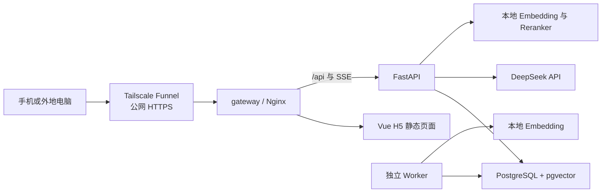

# 阶段 4 至阶段 5：工程化与免费远程访问设计

## 1. 文档状态

- 日期：2026-07-15
- 状态：设计已逐节确认，等待书面规格复核
- 覆盖范围：阶段 4 企业工程能力、阶段 5 手机 H5 与免费远程访问
- 完成边界：阶段 5 验收通过后结束本轮开发

本文是阶段 4 和阶段 5 的总设计，用于固定共同架构、数据边界和验收标准。两个阶段必须分别编写实施计划并顺序执行；阶段 4 完成前不得开始阶段 5。

## 2. 目标

1. 用 PostgreSQL 持久化任务队列替换 FastAPI 进程内 `BackgroundTasks`，使文档任务在 API 或 Worker 重启后仍可观察、重试和继续处理。
2. 将现有知识库所属人隔离收紧为严格的个人私有数据模型：每个用户可以创建多个私有知识库，只能查看、检索、上传、恢复和删除自己的数据。
3. 增加结构化日志、基础指标、审计、Token 用量和回答质量观测能力，同时避免在监控数据中复制文档或问答正文。
4. 通过完整 Docker Compose 启动 gateway、API、Worker 和 PostgreSQL，并只向本机暴露统一 gateway。
5. 将现有 Vue 工作台改造成响应式手机 H5，支持个人知识库、文档、问答、引用、会话、反馈和个人用量。
6. 使用 Tailscale Funnel 将本机 gateway 通过公网 HTTPS 地址提供给自己和少量演示用户，不购买服务器、域名，也不进行备案。
7. 保留简单、可手动执行的数据库与上传文件备份和恢复能力。

## 3. 非目标

本轮不实现以下内容：

- 正式云服务器、域名、ICP备案、生产级高可用或全天候 SLA。
- 微信小程序、微信登录、短信验证码、公开注册、找回密码和支付。
- 共享知识库、团队空间、组织租户、文档转移或跨用户协作。
- Redis、Celery、RabbitMQ、Kafka、Kubernetes 或多 API 实例水平扩容。
- Prometheus、Grafana、ELK、外部告警平台或第三方日志托管。
- 定时备份、云端自动备份、复杂保留策略或灾难恢复编排。
- 断点续传式 SSE、流式事件回放或断线后后台继续生成。
- 由管理员默认读取、检索、下载或删除普通用户内容。

## 4. 当前基线与差距

| 领域 | 当前实现 | 阶段 4～5 目标 |
|---|---|---|
| 文档处理 | FastAPI `BackgroundTasks` | PostgreSQL 持久化任务 + 独立 Worker |
| 知识库权限 | 普通用户按 `owner_id` 隔离，管理员可绕过 | 内容接口对管理员也默认执行所属人隔离 |
| 文档删除 | 立即删除 | 个人回收站、7 天恢复期、幂等永久清理 |
| 会话 | 浏览器 `sessionStorage` | 服务端私有会话与消息状态 |
| Token | 未持久化 | 按调用用途、用户、知识库和时间记录真实用量 |
| 回答质量 | 离线阶段 3 评测 | 离线门禁 + 在线代理指标 + 用户反馈 |
| Docker | 仅 PostgreSQL | gateway、API、Worker、PostgreSQL 完整编排 |
| 前端 | 桌面工作台为主 | 桌面管理 + 响应式手机使用端 |
| 外网入口 | 无 | Tailscale Funnel 公网 HTTPS |

已有 `KnowledgeBase.owner_id` 是本轮隔离基础。文档归属从其知识库推导，客户端不得提交或覆盖所属用户。现有管理员内容绕过必须从普通内容接口中移除，改为独立的只读运营元数据接口。

## 5. 方案选择

### 5.1 持久化任务

采用 PostgreSQL 任务队列。与 Redis + Celery 相比，它少一个中间件，任务状态与业务数据可在同一数据库中协调；与继续使用 `BackgroundTasks` 相比，它能在进程重启后恢复。当前规模只有一台电脑和少量用户，不需要分布式消息系统。

### 5.2 移动端

采用现有 Vue 前端的响应式 H5，不直接开发微信小程序。H5 可以复用现有认证、问答、引用和组件测试，适合先完成手机可用性；微信小程序及其域名、审核和登录适配不在本轮范围。

### 5.3 免费公网访问

采用 Tailscale Funnel。它提供公开 HTTPS 地址且不要求访问者安装客户端。Cloudflare Quick Tunnel 不采用，因为匿名 Quick Tunnel 不支持当前问答所需的 SSE；正式大陆云部署也不采用，因为本轮目标是零服务器和域名费用。

## 6. 阶段边界与依赖

### 6.1 阶段 4：工程化与可部署化

阶段 4 完成：

- PostgreSQL 持久化任务、租约、重试和独立 Worker。
- 严格个人数据隔离、回收站和管理员隐私边界。
- 服务端会话、Token 用量、回答观测、反馈数据基础、审计和基础指标。
- 单进程限速与数据库持久化额度。
- gateway、API、Worker、PostgreSQL 的 Docker Compose。
- 全量自动化回归、临时数据库集成测试、容器重启与任务恢复验收。

### 6.2 阶段 5：手机 H5 与免费远程访问

阶段 5 依赖阶段 4 的所有接口和容器能力，完成：

- 手机知识库、文档、回收站、问答、引用、会话、反馈和个人用量界面。
- 桌面管理员监控、额度和运营元数据界面。
- Tailscale Funnel 启停说明与辅助脚本。
- 简单备份与恢复脚本。
- 使用手机移动网络完成真实外网验收。

阶段 5 完成后停止，不创建阶段 6 实施任务。

## 7. 总体架构



边界规则：

- Funnel 在 Windows 宿主机运行，只转发到 `127.0.0.1` 上的 gateway。
- gateway 是演示编排唯一映射的业务端口；API、Worker、PostgreSQL 和内部指标端点只存在于 Docker 内部网络。
- gateway 提供 Vue 静态文件并代理 `/api` 和 SSE，生产代理必须关闭 SSE 缓冲并设置足够的读取超时。
- 前端与 API 保持同源，继续使用内存 Access Token 和 `HttpOnly + Secure + SameSite` Refresh Cookie。
- 模型缓存由 API 和 Worker 共享磁盘卷，但模型在各自进程内独立加载。

### 7.1 核心数据模型

| 数据 | 设计 |
|---|---|
| `knowledge_bases` | 保留 `owner_id`，增加 `deleted_at`、`purge_after` |
| `documents` | 增加由服务端写入的 `uploaded_by_user_id`、`deleted_at`、`purge_after`；授权仍以知识库所属人为准 |
| `document_jobs` | 由现有 `ingestion_jobs` 演进，保存任务类型、状态、尝试、租约、心跳、阶段和脱敏错误 |
| `conversations`、`conversation_messages` | 保存私有会话、消息正文、状态、引用快照和重新生成关联 |
| `llm_usage_events` | 每次模型调用一条，仅保存用途、Token、价格快照、费用、状态和资源关联 |
| `answer_observations`、`answer_feedback` | 保存在线质量代理指标和所属用户反馈，不复制问答正文 |
| `user_quotas` | 保存用户级问答、上传和存储额度覆盖值；未覆盖时使用系统默认值 |
| `support_access_grants` | 保存单知识库、指定管理员、只读、可撤销和有过期时间的临时授权 |
| `audit_events` | 保存不含正文的安全审计事件 |
| `quality_evaluation_runs` | 保存离线评测的脱敏指标、数据集哈希、模型配置摘要和门禁结论 |

软删除后，原有“知识库 + 文件哈希”唯一约束只对未删除文档生效。恢复时如果已存在相同有效文档，则拒绝恢复并提示先处理冲突，避免产生两份可检索的相同内容。

## 8. PostgreSQL 任务与 Worker

### 8.1 任务状态

持久化任务至少支持：

```text
pending → processing → succeeded
                    ↘ retry_wait → pending
                    ↘ failed
pending/processing → canceled
```

任务记录包含任务类型、资源 ID、尝试次数、最大尝试次数、下次可执行时间、租约持有者、租约过期时间、心跳时间、当前阶段、错误代码和起止时间。任务载荷只保存资源 ID 和非敏感选项，不复制文档正文或密钥。

### 8.2 领取与恢复

- Worker 使用 `SELECT ... FOR UPDATE SKIP LOCKED` 原子领取可执行任务。
- 领取后写入唯一租约标识和过期时间；长任务定期续租。
- Worker 异常退出后，租约过期的任务重新变为可领取状态。
- 默认只对临时网络、模型服务或可恢复资源错误重试，最多 3 次；格式不支持、文件损坏和业务校验失败直接失败。
- 自动重试采用短退避，默认 30 秒和 2 分钟；管理员或所属用户可对最终失败任务发起手动重试。
- Worker 在读取资源、完成解析和提交入库前都重新检查资源所属和删除状态，防止被删除的文档重新进入检索。

### 8.3 幂等性

- 每次成功入库在一个数据库事务中替换该文档的切片和向量。
- 重复执行同一任务不得生成重复切片。
- 过期 Worker 即使晚到，也不能覆盖新租约任务的最终结果。
- Worker 不可用时，已有知识库仍可浏览和问答；新任务保持等待并在界面显示原因。

## 9. 用户隔离与数据生命周期

### 9.1 所有权

- 每个用户可以创建多个私有知识库。
- 文档只能上传到当前用户自己的知识库，上传者由当前登录身份写入，不能从请求体指定。
- 文档、切片、任务、会话、回答观测、反馈和用量都能追溯到知识库所属用户。
- 普通用户的所有内容查询同时约束资源 ID、当前用户 ID 和未删除状态；管理员只有持有仍有效的单知识库只读临时授权时，才走独立的授权查询路径。
- 跨用户访问统一返回安全 404，不暴露资源是否存在。
- 知识库和文档不支持转移、共享或协作。

### 9.2 管理员边界

普通内容接口取消管理员绕过。管理员默认只能查看：账号状态、用户级知识库和文档数量、总字节数、任务状态、错误代码、Token 汇总、质量汇总和系统健康状态。管理员视图不返回知识库名称、文件名、文档正文、问题、回答、引用或下载地址。

如确需内容排障，知识库所属用户可以为指定管理员创建仅针对单个知识库、默认 30 分钟有效的只读临时授权。用户可提前撤销；创建、使用、到期和撤销均记录审计。临时授权不允许上传、删除、永久清理或转移数据。

### 9.3 回收站

- 普通删除写入 `deleted_at` 和 `purge_after`，资源立即从列表、检索、问答和普通下载中消失。
- 默认恢复期为 7 天，用户可恢复或主动永久删除。
- 删除知识库会同时隐藏其文档、会话和未完成任务；恢复知识库时一并恢复仍在恢复期内的子资源。
- 永久清理由 Worker 幂等删除源文件、切片、向量、会话正文和业务记录，只保留不含内容的审计事件。
- 处于回收站的同哈希文件再次上传时返回明确冲突并提示恢复或永久删除，不创建重复文档。

## 10. 服务端会话与中断处理

阶段 5 的会话记录改为服务端持久化并按用户、知识库隔离。现有 `sessionStorage` 历史不自动导入，避免把旧浏览器状态重复写入服务端。

一次流式问答按以下顺序持久化：

1. 创建用户消息和状态为 `streaming` 的助手消息。
2. 进行选择性问题改写、检索、重排和生成。
3. 完成时保存答案、引用、检索统计、计时、结束原因和用量关联。
4. 客户端断开、取消或提供方失败时，将助手消息标为 `interrupted` 或 `failed`，保留服务端已收到的部分内容。
5. 用户主动点击“重新生成”时创建新的助手消息，并通过 `retry_of_message_id` 关联旧消息；系统不自动重新调用模型。

发送给模型的历史仍遵守现有角色、条数和长度限制，不把整个服务端会话无限放入提示词。

## 11. Token、费用与回答质量

### 11.1 Token 用量

每次 DeepSeek 调用分别记录用途 `rewrite` 或 `answer`，以及：

- 模型和请求编号。
- 缓存命中输入 Token、缓存未命中输入 Token。
- 输出 Token、推理 Token 和总 Token。
- 调用耗时、结束原因和是否获得完整 usage。
- 用户、知识库、会话和消息关联。
- 使用当时价格快照计算的预估费用。

流式调用启用 `stream_options.include_usage=true`，以最终 usage 块为准。若连接在 usage 返回前中断，记录“用量未知”，禁止根据字符数伪造精确 Token。预估费用使用可配置单价和定点数或最小货币单位计算；DeepSeek 实际账单仍是最终依据。

为了使费用上限在 usage 缺失时仍然有效，每次模型调用前按已知输入和配置的最大输出预留预算；调用成功后用真实 usage 结算差额。若连接中断且没有 usage，保留该次预留值，避免未知用量被当成零费用。

### 11.2 在线质量观测

在线观测不宣称自动判断事实正确性，只记录可解释的代理指标：

- 是否改写、改写是否回退。
- 原始候选数、重排后接受数、最高和平均相关性。
- 是否拒答、引用数量、引用是否指向本次真实检索片段。
- 无引用直接回答、空检索仍生成等异常事件。
- 改写、检索、生成和总耗时。
- 模型结束原因、失败代码和中断状态。

### 11.3 用户反馈与离线质量

- 每个已完成回答提供“有帮助/没帮助”和可选原因；反馈只能由回答所属用户提交或修改。
- 反馈关联消息 ID，不在指标或日志中重复保存问答正文。
- 阶段 3 的 Recall@5、Citation Hit Rate、Refusal Accuracy、P50/P95 和质量门继续作为离线回归依据。
- 管理界面展示最近一次脱敏评测摘要、在线风险指标和反馈分布，但不得把代理指标合成为含义不明的“正确率”。

## 12. 日志、指标与审计

### 12.1 日志

- 开发环境使用可读文本，生产演示环境向标准输出写结构化 JSON。
- 日志字段包括时间、级别、服务、request_id、user_id、knowledge_base_id、document_id、job_id、路由、状态码、耗时和安全错误代码。
- 不记录密码、Access/Refresh Token、API Key、数据库连接串、完整文件路径、文档正文、完整问题、完整回答或提示词。

### 12.2 基础指标

内部指标端点只在 Docker 网络中访问，记录 API 请求数、错误率、延迟、任务状态数、处理耗时、Worker 心跳和模型调用耗时。阶段 4 不部署抓取和可视化平台；持久化的 Token、质量、反馈和任务汇总由管理员 API 与页面展示。

### 12.3 审计

审计事件至少覆盖：登录成功或失败、创建或停用用户、创建或删除知识库、上传或删除文档、恢复或永久清理、手动重试、额度变更、临时授权及重要配置变更。事件只保存操作人、动作、资源类型与 ID、结果、时间和安全摘要。

## 13. 安全、限速与费用保护

- 保留管理员创建账号，不开放注册、短信和微信登录。
- 生产演示必须使用随机 JWT 密钥、Secure Refresh Cookie 和精确 `TRUSTED_ORIGINS`。
- gateway 只接受 Funnel 和本机访问路径；FastAPI 只信任来自 gateway 的代理头。
- 登录按账号与可信 gateway 提供的来源信息限速，默认 10 分钟内最多 5 次失败尝试；无法可靠取得来源 IP 时退化为账号级和全局限速，不信任客户端自行提交的转发头。
- 问答按用户限速，默认每分钟最多 10 次；限速在单 API 进程内实现，重启后重置是当前单机边界。
- 数据库持久化用户额度，默认每天 50 次问答、每天 20 个上传文件、500 MiB 有效文件存储；管理员可按用户调整。
- 全局月度预估费用上限默认 20 元，可由本机环境配置修改。达到用户额度或全局上限后，在调用 DeepSeek 前拒绝并返回友好提示。
- 单文件继续沿用当前 20 MiB 限制，并继续校验扩展名、内容类型、文件名和解析结果。
- 上传文件不放入 gateway 静态目录，引用和下载必须再次执行所属人校验。

## 14. Docker 与本地运行

演示编排包含：

| 服务 | 职责 | 公网/宿主机暴露 |
|---|---|---|
| gateway | Vue 静态文件、API/SSE 反向代理 | 仅 `127.0.0.1` 演示端口 |
| api | 认证、业务 API、问答和管理汇总 | 不暴露 |
| worker | 文档入库、重试、回收站清理 | 不暴露 |
| postgres | 业务、任务、向量、审计和用量数据 | 演示编排不暴露 |

持久化卷至少包括 PostgreSQL 数据、上传文件和 Hugging Face 模型缓存。开发环境继续允许单独启动前后端，并通过独立的开发 Compose 暴露 PostgreSQL；不得为了 Docker 演示破坏现有开发和测试命令。

API 提供存活与就绪检查；Worker 提供数据库连接、心跳和当前任务状态；gateway 检查静态页面和 API 就绪。Worker 未就绪不应使已有知识库浏览和问答整体不可用。

## 15. 手机 H5

手机端沿用现有 Vue 和 Element Plus 体系，使用响应式布局，不另建第二套前端工程。

主要入口：

1. **知识库**：创建、重命名和删除个人知识库；上传文档；查看处理状态、错误、重试和回收站；创建或撤销单知识库临时排障授权。
2. **会话**：创建或继续会话；查看流式回答、引用、历史、中断状态和重新生成入口。
3. **我的**：查看个人 Token、预估费用、额度、反馈记录和退出登录。

手机引用使用底部抽屉展示；危险删除要求二次确认；长列表分页或继续加载；上传显示文件名、大小和处理进度。桌面端保留更完整的知识库管理，用户管理、全局质量、任务和费用监控只要求桌面体验完整。

## 16. Tailscale Funnel

Tailscale 安装并运行在 Windows 宿主机，不打包进 Docker。阶段 5 提供启停说明或辅助脚本，将稳定的 `*.ts.net` HTTPS 地址转发到本机 gateway。

运行流程：

```text
启动 Docker Compose
→ 等待健康检查通过
→ 启动 Tailscale Funnel
→ 输出公网 HTTPS 地址
→ 使用手机移动网络验收
```

该方案只用于个人和少量演示用户。电脑关机、休眠、断网或 Docker 停止后服务不可访问；Funnel 的 Beta 状态、带宽限制和中国大陆网络波动属于已接受边界。

## 17. 简单备份与恢复

- `backup.ps1` 手动导出 PostgreSQL，并复制上传文件到带时间戳的备份目录。
- `restore.ps1` 在明确确认后恢复数据库和上传文件。
- 建议在系统升级或导入重要文档前执行一次备份。
- 不备份模型缓存、容器镜像和日志；需要时重新下载或构建。
- 不实现定时任务、自动清理、校验清单、云同步和备份管理页面。

## 18. 错误处理

- 所有外部错误转换为稳定的业务错误代码，不向前端暴露文件路径、连接串或模型请求正文。
- 文档失败必须区分可重试与永久失败，并向所属用户显示脱敏原因。
- SSE 断开后将回答标记为 `interrupted`，保留部分内容；只能由用户主动重新生成。
- DeepSeek 返回截断、内容过滤或资源不足时保存结束原因，并在界面明确提示。
- Token usage 缺失、指标写入失败和审计写入失败不得伪装为成功；其中审计与额度保护所需的持久化失败必须阻止对应敏感操作。
- 回收站清理和文件系统删除使用幂等步骤，部分失败后可由 Worker 重试。

## 19. 验收门禁

### 19.1 阶段 4

- API、Worker、PostgreSQL 和 gateway 可通过 Docker Compose 启动并通过健康检查。
- API 或 Worker 重启后，等待和处理中任务不丢失，过期租约可被重新领取。
- 同一任务重复或晚到提交不产生重复切片，也不能覆盖新任务结果。
- 两个普通用户不能互相访问知识库、文档、任务、会话、引用、反馈和用量。
- 管理员普通内容接口不再绕过所属人；运营接口不返回名称、正文或下载地址。
- 文档回收、恢复和永久清理行为正确，已删除内容不参与检索。
- 普通与流式 DeepSeek 调用均能采集 usage；断线缺失 usage 时标记未知。
- 结构化日志、指标和审计通过敏感信息测试。
- 后端全量测试、临时 PostgreSQL 集成测试、迁移升降级、Ruff 检查和格式检查通过。
- 前端全量测试和生产构建通过。
- 阶段 3 的真实评测和既有质量门继续通过；3C 既有受限豁免事实保持原样。

### 19.2 阶段 5

使用手机移动网络而不是家庭 Wi-Fi 完成：

1. 通过 Funnel HTTPS 地址登录。
2. 创建个人知识库并上传文档。
3. 观察文档由等待进入处理并最终可用。
4. 提问并收到流式回答和正确引用。
5. 查看个人 Token 与额度并提交反馈。
6. 删除、恢复并永久删除自己的文档。
7. 使用第二个账号确认严格数据隔离和安全 404。
8. 模拟网络中断，确认回答标为中断且只能手动重新生成。
9. 达到限速或额度后确认不会继续调用 DeepSeek。
10. 执行一次简单备份和恢复冒烟验证。

同时从外网确认只能访问 gateway，PostgreSQL、FastAPI 原始端口、Worker 和内部指标端点均不可直接访问。

## 20. 实施计划拆分

本文不是单一大任务的实施清单。书面设计通过复核后，按以下顺序分别编写计划：

1. 阶段 4 计划：持久化 Worker、严格隔离与生命周期、会话/用量/质量基础、可观测性、安全额度和完整 Docker。
2. 阶段 5 计划：响应式 H5、管理员监控、Funnel、简单备份与真实移动网络验收。

任何阶段都必须先测试、再实现、再完成门禁；阶段 4 未完成时不得提前开发阶段 5。

## 21. 外部约束参考

- [Tailscale Funnel 官方文档](https://tailscale.com/docs/features/tailscale-funnel)：Funnel 面向公网转发本地服务，当前为 Beta，存在固定端口和不可配置带宽限制。
- [Tailscale 免费个人计划](https://tailscale.com/kb/1154/free-plans-discounts)：当前个人计划允许少量用户免费使用，实际条款以执行时官方页面为准。
- [Cloudflare Quick Tunnel 官方文档](https://developers.cloudflare.com/cloudflare-one/networks/connectors/cloudflare-tunnel/do-more-with-tunnels/trycloudflare/)：匿名 Quick Tunnel 不支持 SSE，因此不作为本项目流式问答入口。
- [DeepSeek 对话补全接口](https://api-docs.deepseek.com/zh-cn/api/create-chat-completion/)：流式请求可通过 `stream_options.include_usage` 在结束前获得完整 usage。
- [DeepSeek 模型与价格](https://api-docs.deepseek.com/zh-cn/quick_start/pricing)：价格可能调整，实施时必须使用可配置单价并保留价格快照。
