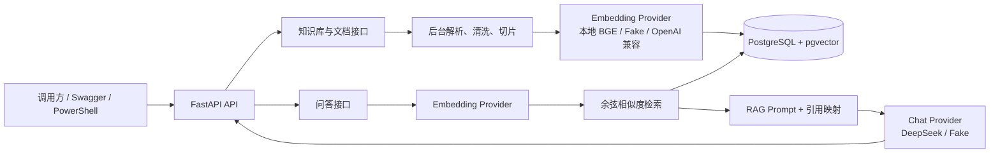

# 阶段 1E：验证与演示指南

这一阶段不增加新的业务功能，而是证明第一阶段的 RAG 后端能被重复验证和清晰展示。

## 验收范围

- 单元测试覆盖切片、Embedding、检索、Prompt、问答服务和冒烟脚本的轮询行为。
- 集成测试覆盖 PostgreSQL + pgvector、上传、入库、检索和问答接口。
- Docker 冒烟脚本覆盖真实 HTTP 链路：创建知识库、上传文本、等待处理、问答、检查引用。
- README 提供中文启动说明、API 示例与验证命令。
- 本文提供架构图和五分钟演示脚本。

## 架构图



## Docker 冒烟测试

1. 在项目根目录启动数据库：

   ```powershell
   docker compose -f deploy/docker-compose.yml up -d
   ```

2. 在 `backend` 目录执行迁移，并以 Fake Provider 启动 API。`RAG_SCORE_THRESHOLD=-1` 是为了使确定性的 Fake Embedding 能稳定走到引用检查；这不是生产推荐配置。

   ```powershell
   uv run alembic upgrade head
   $env:EMBEDDING_PROVIDER = "fake"
   $env:CHAT_PROVIDER = "fake"
   $env:RAG_SCORE_THRESHOLD = "-1"
   uv run uvicorn app.main:app --host 127.0.0.1 --port 8000 --loop app.core.event_loop:new_event_loop
   ```

3. 新开 PowerShell 窗口，执行：

   ```powershell
   Set-Location backend
   uv run python -m scripts.smoke_test
   ```

通过时会输出“冒烟测试通过”。若失败，脚本会返回非零退出码，并报告 HTTP 错误、文档处理错误、超时或引用校验错误。

## 五分钟演示脚本

### 0:00～0:40：项目目标

“这是一个面向企业私有文档的 RAG 知识库后端。我用它练习从 C# 转向 Python AI 工程时的分层、依赖注入、异步数据库和模型服务抽象。”

### 0:40～1:30：上传与入库

打开 Swagger，创建“人事制度”知识库，上传包含年假规则的 TXT 或 PDF。展示文档接口中的状态从 `pending` 变为 `ready`，说明后台完成了解析、清洗、切片和向量写入。

### 1:30～2:30：检索与回答

调用问答接口：`员工入职满一年后有多少天年假？`。展示返回的 `answer`、`citations`、`relevance_score` 和文档页码/片段，强调引用不是由模型编造，而是由数据库检索结果映射得到。

### 2:30～3:10：拒答保护

提一个文档中不存在的问题，例如“公司的股票期权如何计算？”。说明低相关性时系统返回固定拒答，不请求聊天模型，避免幻觉和不必要的模型成本。

### 3:10～4:10：工程结构

展示本文架构图。说明 `EmbeddingProvider` 和 `ChatProvider` 类似 C# 的接口加实现类：可在本地 BGE、Fake Provider 和 OpenAI 兼容服务之间切换；`RagService` 集中编排用例，API 层只负责 HTTP。

### 4:10～5:00：质量验证

展示 `uv run pytest -v`、Ruff 检查和 `uv run python -m scripts.smoke_test`。强调自动化验证默认使用 Fake Provider，不泄露 Key，也不会因真实模型调用产生费用。

## 面试问答准备

| 问题 | 简要回答 |
| --- | --- |
| 为什么使用 pgvector？ | 第一阶段数据量小，PostgreSQL 可同时保存业务元数据和向量，运维复杂度低。 |
| 为什么保留 Fake Provider？ | 让自动化测试稳定、离线且无费用，同时保持与真实 Provider 相同的接口。 |
| 如何减少幻觉？ | 检索结果低于阈值时固定拒答；有证据时只把检索片段送给模型，并返回结构化引用。 |
| 后续如何产品化？ | 增加 Vue 前端、JWT 与知识库权限隔离、流式回答、聊天历史，以及可恢复的异步任务队列。 |
